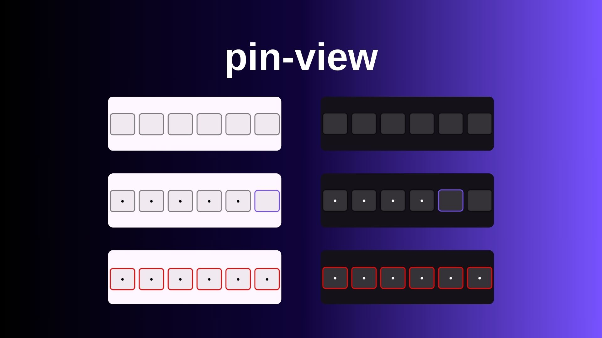

# PinView
PinView is an input design with a pin. With this library you can add a simple custom pin view. It only supports 6 character passwords.



## Installation
First, add the following dependency to settings.gradle file
```gradle
dependencyResolutionManagement {
    repositoriesMode.set(RepositoriesMode.FAIL_ON_PROJECT_REPOS)
    repositories {
        ..
        mavenCentral()
        maven { url 'https://jitpack.io' }
    }
}
```
Later, add this implementation build.gradle (Module:app)

[](https://jitpack.io/#avcialper/pin-view)

```gradle
dependencies {
    ..
    implementation 'com.github.avcialper:pin-view:1.0.0'
}
```

## Usage
Add the following to the xml file to use
```xml
<com.avcialper.pinview.PinView
    android:id="@+id/pin_view"
    android:layout_width="match_parent"
    android:layout_height="wrap_content"
    android:textColor="@color/white"
    app:border_width="6"
    app:error_border_color="#FF0000"
    app:pin_background="#34BAB7B7"
    app:selected_border_color="#7752FE"
    app:unselected_border_color="#7A000000" />
```
```kotlin
// implement PinViewListener to xml's class
class MainActivity : AppCompatActivity(), PinViewListener {

    private lateinit var binding: ActivityMainBinding

    override fun onCreate(savedInstanceState: Bundle?) {
        super.onCreate(savedInstanceState)
        binding = ActivityMainBinding.inflate(layoutInflater)
        setContentView(binding.root)

        // to listen for the completion of the pin input
        binding.pinView.setPinListener(this)
    }

    override fun onPinEntryCompleted(pin: String) {
        val yourPin = "123456"

        if(pin == yourPin){
            Toast.makeText(applicationContext, "Correct password!", Toast.LENGTH_SHORT).show()
        }
        else{
            // if the pin doesn't match, you can change pin-view type to error
            binding.pinView.changePinBoxBackground(true)
        }
    }
}
```

https://github.com/avcialper/pin-view/assets/90919011/54e9b42d-7f39-49f2-ac7e-f9bf72d669d9

